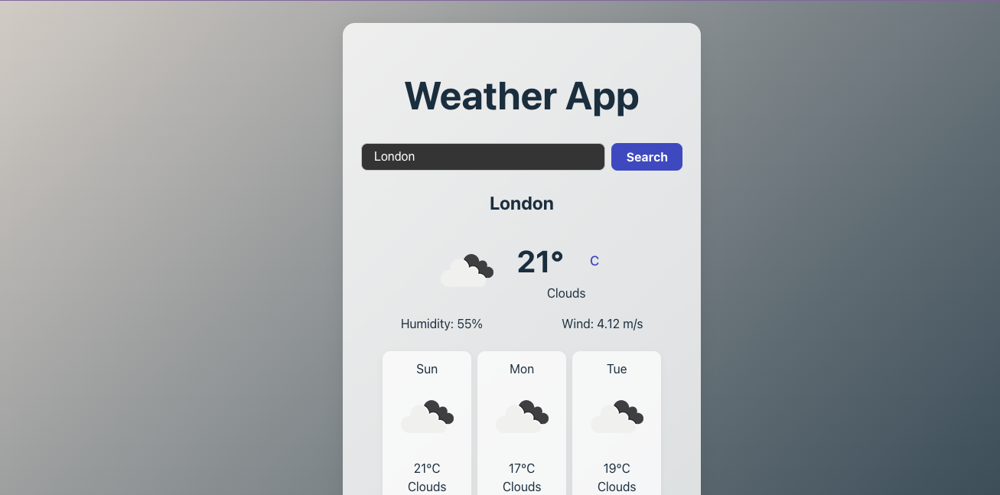

# Weather App

A real-time weather application built with React and Vite. Fetches data from OpenWeatherMap and displays current weather and 5-day forecasts in a clean, user-friendly interface.

<p align="center">
  
</p>

## 🚀 Live Demo

[View Live Demo](https://chams-sat.github.io/Weather-app/)

## Features

- Search for any city to get weather data
- Current weather: temperature (°C/°F toggle), condition, humidity, wind speed, UV index, icon
- 5-day forecast in card layout
- Dynamic background based on weather
- Responsive design (mobile & desktop)
- (Bonus) Dark/Light mode toggle, geolocation, animated icons

## Tech Stack

- React
- Vite
- CSS (custom or framework)
- OpenWeatherMap API

## Getting Started

1. **Install dependencies:**
   ```bash
   npm install
   ```
2. **Start the development server:**
   ```bash
   npm run dev
   ```
3. **Open** [http://localhost:5173](http://localhost:5173) in your browser.

## API Setup

- Get a free API key from [OpenWeatherMap](https://openweathermap.org/api).
- Create a `.env` file in the project root:
  ```env
  VITE_OPENWEATHER_API_KEY=your_api_key_here
  ```

## Folder Structure

- `src/components/` – React components
- `src/assets/` – Images, icons, etc.
- `src/utils/` – Utility functions (API calls, helpers)

---

- Designed and developed by Chams Satour.
- Built with ❤️ using React + Vite.
